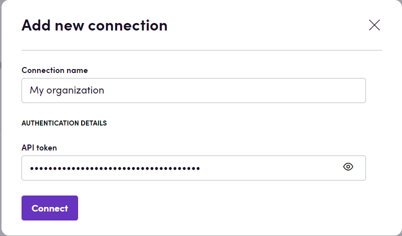

# Blackbird.io Hugging Face

Blackbird is the new automation backbone for the language technology industry. Blackbird provides enterprise-scale automation and orchestration with a simple no-code/low-code platform. Blackbird enables ambitious organizations to identify, vet and automate as many processes as possible. Not just localization workflows, but any business and IT process. This repository represents an application that is deployable on Blackbird and usable inside the workflow editor.

## Introduction

<!-- begin docs -->

Hugging Face is a platform that provides tools for building, training and deploying machine learning models. It offers a rich repository of pre-trained models and user-friendly tools, empowering developers and researchers to efficiently create and optimize state-of-the-art ML models for various tasks, particularly in the domain of natural language processing.

## Before setting up

Before you can connect you need to:

- Create a [Hugging Face account](https://huggingface.co/join).
- Get [Access Token](https://huggingface.co/settings/tokens): 
    * Click _New token_.
    * Enter a _Name_ for the token and select the _Role_ from the dropdown.
    * Click the _Generate a token_ button.
    * Next to generated token, click on _Copy token to clipboard_ icon.

### Training or finetuning a model using custom data

Hugging Face provides a tool for training ML models which can be used to better accommodate your needs. You can read more about AutoTrain [here](https://huggingface.co/docs/autotrain/index). Once the model is trained on your data, you can use it via Blackbird just like any other model. 

## Connecting

1. Navigate to apps and search for Hugging Face. If you cannot find Hugging Face then click _Add App_ in the top right corner, select Hugging Face and add the app to your Blackbird environment.
2. Click _Add Connection_.
3. Name your connection for future reference e.g. 'My organization'.
4. Fill in the API token obtained in the previous section.
5. Click _Connect_. 
6. Confirm that the connection has appeared and the status is _Connected_.

## Actions

### Text

- **Summarize text** summarizes longer text into shorter text.
- **Answer question** answers the question given a context. Context is a text where the answer could be found.
- **Classify text** performs text classification. Possible labels vary depending on model used. Can be useful for sentiment analysis.
- **Classify text according to candidate labels** performs text classification and, unlike **Classify text** action, uses the provided labels for prediction.
- **Translate text**. Source and target language depend on model used.
- **Fill mask** fills in a hole or holes with missing words and returns text with filled holes. Use mask token to specify the place to be filled. Mask token can differ depending on model used, but the most commonly used tokens are [MASK] or <mask>. You should check the mask token used by specific model on its [Hugging Face page](https://huggingface.co/models?pipeline_tag=fill-mask&sort=trending).
- **Calculate semantic similarity** calculates semantic similarity between two texts and returns similarity score in the range from 0 to 1.
- **Generate text** continues text from a prompt.
- **Chat** performs conversational task. To give a context, you can specify past user inputs and previously generated responses which should have the same lengths.
- **Generate embedding** generates text embedding - a list of floating point numbers that captures semantic information about the text that it represents. Embeddings can be used to store data in vector databases (like Pinecone).

### Audio

- **Create transcription** generates a transcription given an audio file (Flac, Wav, Mp3, Ogg etc.).
- **Classify audio** performs audio classification. Possible labels vary depending on model used.

## Missing features

In the future we can add actions for:

- Image classification
- Image detection
- Image segmentation

Let us know if you're interested!

<!-- end docs -->
